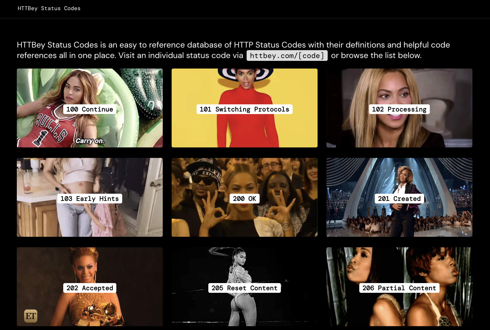

# HTTBey

Like HTTP Status Cats, but Beyoncé

## Development

This project requires Node v18+ to build. (Consider using a version manager like [nvm][1] to easily switch node versions!). As of v2.0.0 it's built with Next.js 13.

Run `npm install` to pull in dependencies and then `npm run dev`. The app should build, run, and be available at [localhost:3000][2].

[1]: https://github.com/nvm-sh/nvm
[2]: http://localhost:3000
